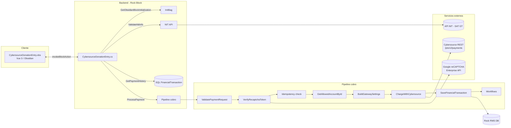
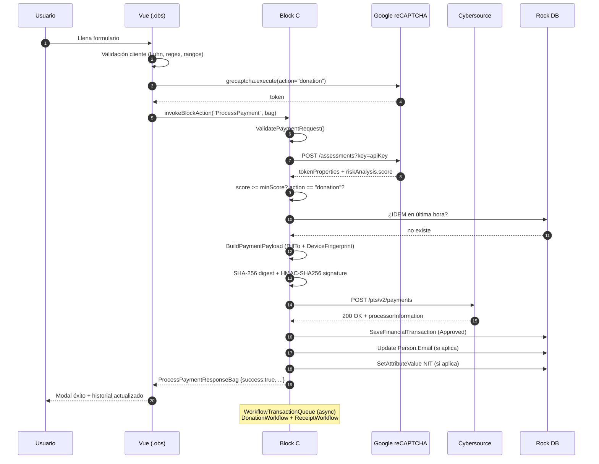
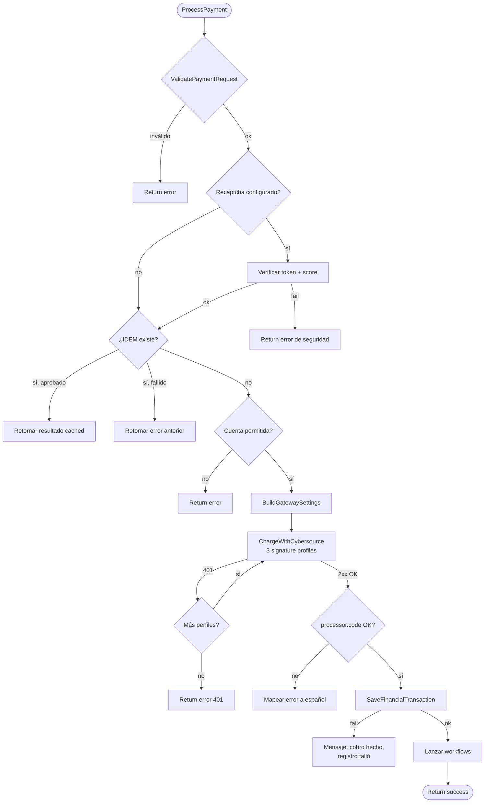
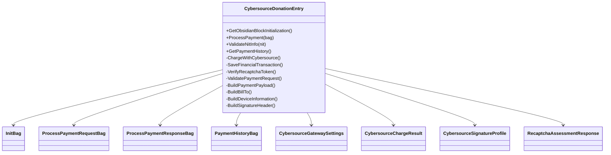

# CybersourceDonationEntry.cs — Documentación Técnica

> **Backend (C# / Rock RMS Block)** del flujo de donaciones DAR vía Cybersource.
> **Ruta:** [`Rock.Blocks/Dar/CybersourceDonationEntry.cs`](CybersourceDonationEntry.cs)
> **Frontend pareado:** [`Rock.JavaScript.Obsidian.Blocks/src/Dar/CybersourceDonationEntry.obs`](../../../Rock.JavaScript.Obsidian.Blocks/src/Dar/CybersourceDonationEntry.obs)
> **Rama actual:** `hotfix-18.1` · **Última actualización:** 2026-04-29
>
> **Nota de scope:** El procesador `vdcguatemala` (Visanet Guatemala) **no soporta American Express**. Las marcas habilitadas son **Visa y Mastercard**. AmEx se rechaza explícitamente en frontend y backend; ver §7 paso 1 y §12.5.

---

## Índice

1. [Propósito](#1-propósito)
2. [Identidad del bloque](#2-identidad-del-bloque)
3. [Atributos de configuración](#3-atributos-de-configuración)
4. [Arquitectura general](#4-arquitectura-general)
5. [Diagramas](#5-diagramas)
6. [Block Actions (endpoints)](#6-block-actions-endpoints)
7. [Flujo end-to-end de un cobro](#7-flujo-end-to-end-de-un-cobro)
8. [Anti-fraude: las 4 features](#8-anti-fraude-las-4-features)
9. [Integraciones externas](#9-integraciones-externas)
10. [Persistencia en Rock Finance](#10-persistencia-en-rock-finance)
11. [Firma HMAC-SHA256 de Cybersource](#11-firma-hmac-sha256-de-cybersource)
12. [Normalización de datos](#12-normalización-de-datos)
13. [DTOs / Bags](#13-dtos--bags)
14. [Manejo de errores y logging](#14-manejo-de-errores-y-logging)
15. [Catálogo de métodos](#15-catálogo-de-métodos)
16. [Dependencias](#16-dependencias)
17. [Checklist de despliegue](#17-checklist-de-despliegue)

---

## 1. Propósito

Bloque Obsidian que **procesa donaciones con tarjeta a través de Cybersource REST API** y las registra en el módulo Rock Finance. Soporta:

- Donantes **logueados** y **anónimos**.
- Monedas **GTQ y USD** (multi-divisa).
- **Recibo fiscal** opcional con validación de **NIT** contra API SAT (Guatemala).
- **Anti-fraude**: reCAPTCHA Enterprise, AVS, Device Fingerprint e idempotencia.
- **Workflows** opcionales para post-procesamiento (donación + recibo).
- **Historial** de pagos por usuario.

---

## 2. Identidad del bloque

| Propiedad | Valor |
|---|---|
| **Namespace** | `Rock.Blocks.Dar` |
| **Clase** | `CybersourceDonationEntry : RockBlockType` |
| **Display Name** | `Cybersource Donation Entry` |
| **Categoría** | `Custom` |
| **Icono** | `fa fa-credit-card` |
| **BlockTypeGuid** | (declarado en [CybersourceDonationEntry.cs:314](CybersourceDonationEntry.cs#L314)) |
| **ObsidianFileUrl** | `~/Obsidian/Blocks/Dar/cybersourceDonationEntry.obs` |

---

## 3. Atributos de configuración

Los atributos están agrupados en **4 categorías** (`AttributeCategory.Finance`, `Gateway`, `Security`).

### 3.1. Finance ([líneas 47-129](CybersourceDonationEntry.cs#L47-L129))

| Key | Tipo | Default | Descripción |
|---|---|---|---|
| `AccountsToDisplay` | AccountsField | — | Cuentas financieras permitidas en el bloque. |
| `FinancialGateway` | FinancialGatewayField | — | Gateway a asignar en `FinancialTransaction`. |
| `TransactionType` | DefinedValueField | `CONTRIBUTION` | Tipo de transacción. |
| `FinancialSourceType` | DefinedValueField | `WEBSITE` | Source type de la transacción. |
| `BatchNamePrefix` | TextField | `"Cybersource Online Giving"` | Prefijo de batch financiero. |
| `DefaultCurrency` | TextField (GTQ\|USD) | `USD` | Moneda por defecto. |
| `DonationWorkflow` | WorkflowTypeField | — | Workflow opcional ejecutado tras éxito. |
| `ReceiptWorkflow` | WorkflowTypeField | — | Workflow opcional para recibo fiscal. |
| `PersonNitAttributeKey` | TextField | — | Key del atributo de Persona donde acumular NITs. |

### 3.2. NIT API ([líneas 131-150](CybersourceDonationEntry.cs#L131-L150))

| Key | Descripción |
|---|---|
| `NitApiUrl` | URL del API externo de validación de NIT (Guatemala). |
| `NitApiBearerToken` | Token Bearer (encriptado). |

### 3.3. Cybersource ([líneas 152-274](CybersourceDonationEntry.cs#L152-L274))

| Key | Default | Descripción |
|---|---|---|
| `UseLiveMode` | `false` | Cambia entre credenciales test/live. |
| `UseLegacyDateHeader` | `false` | Permite headers `date` / `(request-target)` legacy. |
| `PaymentsPath` | `/pts/v2/payments` | Path REST del endpoint. |
| `TestHost` | `apitest.cybersource.com` | Host de pruebas. |
| `LiveHost` | `api.cybersource.com` | Host de producción. |
| `TestBaseUrl` / `LiveBaseUrl` | — | URL base alternativa opcional. |
| `TestMerchantId` / `LiveMerchantId` | — | Merchant ID. |
| `TestKeyId` / `LiveKeyId` | — | Key ID. |
| `TestSharedSecretBase64` / `LiveSharedSecretBase64` | — | Shared secret en Base64 (**encriptado**). |
| `TimeoutMs` | `30000` | Timeout HTTP en ms. |

### 3.4. Security ([líneas 276-311](CybersourceDonationEntry.cs#L276-L311))

| Key | Default | Descripción |
|---|---|---|
| `RecaptchaSiteKey` | — | Site key público de reCAPTCHA Enterprise. |
| `RecaptchaApiKey` | — | API key de Google Cloud (encriptado). |
| `RecaptchaProjectId` | — | Proyecto Google Cloud. |
| `RecaptchaMinScore` | `50` (=0.5) | Score mínimo aceptable (escala 0-100). |

---

## 4. Arquitectura general



---

## 5. Diagramas

### 5.1. Diagrama de secuencia — cobro exitoso



### 5.2. Diagrama de flujo — decisión de cobro



### 5.3. Diagrama de componentes internos



---

## 6. Block Actions (endpoints)

### 6.1. `GetObsidianBlockInitialization()` — [línea 320](CybersourceDonationEntry.cs#L320)

Devuelve `InitBag` cuando el componente Vue se monta. Incluye:

- `mode` (`live`/`test`)
- `accounts` (cuentas permitidas)
- `history` (historial del usuario logueado)
- `currentPersonEmail`
- `cybersourceOrgId` (`1snn5n9w`=test, `k8vif92e`=live) y `cybersourceMerchantId` para Device Fingerprint
- `recaptchaSiteKey`
- `defaultCurrency`, `notLogged`

### 6.2. `ValidateNitInfo(string nit)` — [línea 356](CybersourceDonationEntry.cs#L356)

Acción AJAX para autocompletar **razón social** y **dirección** del recibo fiscal.

| Aspecto | Detalle |
|---|---|
| **Input** | `nit` (string, max 32, alfanumérico) |
| **Externo** | POST XML a `NitApiUrl` con Bearer token, timeout 15s |
| **Parsing** | Regex sobre `<nombre>` y `<direccion>` del XML respuesta |
| **Output** | `{ name, address }` o error |
| **Seguridad** | Limita longitud para mitigar enumeración |

### 6.3. `GetPaymentHistory()` — [línea 441](CybersourceDonationEntry.cs#L441)

Lista las **últimas 100 transacciones** del usuario logueado.

| Aspecto | Detalle |
|---|---|
| **Filtro** | `ForeignKey LIKE 'CYBS|%'` + `AuthorizedPersonAlias = currentPerson` |
| **Origen** | SQL directo con `JOIN` a `FinancialAccount`, `FinancialPaymentDetail` |
| **Mapeo** | Cada fila a `PaymentHistoryBag` (extrae IDEM, MODE, CUR, RC, REF, AUDIT, AUTH del ForeignKey) |

### 6.4. `ProcessPayment(ProcessPaymentRequestBag bag)` — [línea 459](CybersourceDonationEntry.cs#L459)

**Endpoint principal**. Pipeline completo de cobro: validación → reCAPTCHA → idempotencia → cobro Cybersource → registro Rock → workflows.

---

## 7. Flujo end-to-end de un cobro

| # | Paso | Método | Detalle |
|---|---|---|---|
| 1 | Validación de DTO | `ValidatePaymentRequest` ([línea 1083](CybersourceDonationEntry.cs#L1083)) | accountId, email, amount (0..99,999,999), card 12-19, expMonth 1-12, expYear ±25, cvv 3-4, currency GTQ\|USD. **Rechaza AmEx** (PAN comenzando con `34` o `37`) — ver §12.5. |
| 2 | reCAPTCHA Enterprise | `VerifyRecaptchaToken` ([línea 976](CybersourceDonationEntry.cs#L976)) | POST a Google. Verifica `valid`, `action=="donation"`, `score>=minScore`. |
| 3 | Cuenta permitida | `GetAllowedAccountById` | Verifica que `accountId` esté en `AccountsToDisplay`. |
| 4 | Reserva idempotencia | `ReserveIdempotencySlot` | `sp_getapplock` + busca `IDEM={key}` (autenticado por persona, anónimo por `AliasId NULL`); si existe `Approved`/`Pending` no cobra; si no, inserta fila `Pending` durable. |
| 5 | Settings Cybersource | `BuildGatewaySettings` | Carga credenciales según modo, desencripta secret. |
| 6 | Cobro | `ChargeWithCybersource` | Construye payload, **fuerza HTTPS**, calcula digest, firma HMAC, intenta hasta 3 perfiles. |
| 7 | Parseo respuesta | `BuildChargeResultFromCybersourceResponse` | Determina `ok` y `ambiguous` (5xx/timeout), mapea error a español. |
| 8 | Persistencia | `FinalizeApprovedTransaction` (o `DeletePendingTransaction`) | Aprobado → promueve `Pending`→`Approved`, batch por moneda. Rechazo definitivo → borra reserva. Ambiguo → conserva `Pending`. |
| 9 | Auto-update Persona | `SavePersonEmail` + `SavePersonNitAttribute` | Si logueado, actualiza email vacío y agrega NIT al atributo. |
| 10 | Workflows | `EnqueueFinancialTransactionWorkflow` x2 | Donación y recibo (si configurados y procede). |
| 11 | Respuesta | `ProcessPaymentResponseBag` | Devuelve success, message, códigos, transactionId, history actualizado. |

---

## 8. Anti-fraude: las 4 features

> Las 4 features mencionadas en el commit `ab22c5b862 — security review + 4 features anti-fraude + reCAPTCHA + normalización`.

### Feature 1: reCAPTCHA Enterprise

- **Dónde:** [`VerifyRecaptchaToken` líneas 976-1081](CybersourceDonationEntry.cs#L976-L1081).
- **Cómo:** Cliente genera token JS → backend valida vs Google → exige `score >= minScore` y `action == "donation"`.
- **Bypass:** Si falta cualquiera de los 3 atributos (`SiteKey`, `ApiKey`, `ProjectId`), se omite (modo desarrollo).

### Feature 2: Device Fingerprint

- **Dónde:** [`BuildDeviceInformation` líneas 1797-1837](CybersourceDonationEntry.cs#L1797-L1837).
- **Datos enviados a Cybersource:** `ipAddress`, `userAgent` (≤255), `fingerprintSessionId` (alfanumérico ≤32).
- **Cliente:** carga iframe oculto a `h.online-metrix.net/fp/tags?org_id=...`.
- **Org IDs:** `1snn5n9w` (test) / `k8vif92e` (live).

### Feature 3: AVS — Address Verification System

- **Dónde:** [`BuildBillTo` líneas 1635-1764](CybersourceDonationEntry.cs#L1635-L1764).
- **Normalización defensiva:** estado `GT` o `GUATEMALA` → `GU`; ciudad `Guatemala` → `Guatemala City` (coincide geo-IP).
- **Fallbacks:** si firstName vacío → `"Donante"`; dirección de respaldo `19 Avenida 16-02, Zona 10`, postal `01010`, país `GT`.
- **Beneficio:** evita flags `COR-BA` y `MM-IPBC` de Cybersource Decision Manager y mejora ratio AVS-match.

### Feature 4: Idempotencia (reforzada 2026-06-21)

- **Dónde:** `ReserveIdempotencySlot` / `FinalizeApprovedTransaction` / `DeletePendingTransaction`.
- **Clave:** `idemKey` enviado por cliente (timestamp+random), **obligatorio**, cap 32 chars.
- **Patrón fila `Pending` durable:** la transacción se reserva en BD (`Status="Pending"`)
  **antes** de cobrar y se promueve a `Approved` después. Esto da idempotencia a
  donantes **anónimos** (antes no la tenían) y cierra el hueco "cobrado pero no guardado".
- **Locks:** in-process por `idemKey` + `sp_getapplock` cross-node (transaction-scoped).
- **Persistencia:** la clave se almacena en `ForeignKey` con prefijo `IDEM=`. Ventana 1 hora.
- **Resultado si encuentra duplicado:** `Approved` → resultado recuperado;
  `Pending` → "en proceso, no reintente". En ambos casos **no recobra**.
- **Resultado ambiguo del cobro** (timeout/5xx) → conserva la fila `Pending` para
  bloquear el recobro; rechazo definitivo → borra la reserva y permite reintento.

---

## 9. Integraciones externas

### 9.1. Cybersource REST `/pts/v2/payments`

```text
POST https://{host}/pts/v2/payments
Headers:
  Host: {host}
  Date: <RFC 1123>            (legacy)
  v-c-date: <RFC 1123>        (recomendado)
  Digest: SHA-256={base64}
  v-c-merchant-id: {merchantId}
  Signature: keyid="{keyId}", algorithm="HmacSHA256",
             headers="host v-c-date (request-target) digest v-c-merchant-id",
             signature="{base64}"
Body: { clientReferenceInformation, processingInformation,
        orderInformation, paymentInformation, deviceInformation }
```

### 9.2. Google reCAPTCHA Enterprise

```text
POST https://recaptchaenterprise.googleapis.com/v1/projects/{projectId}/assessments?key={apiKey}
Body: { event: { token, siteKey, expectedAction: "donation" } }
```

### 9.3. API NIT (Guatemala)

```text
POST {NitApiUrl}
Headers: Authorization: Bearer {NitApiBearerToken}
Body (XML):
  <RetornaDatosClienteRequest><nit>{nit}</nit></RetornaDatosClienteRequest>
```

---

## 10. Persistencia en Rock Finance

`BuildPendingTransaction` (reserva, `Status="Pending"`) + `FinalizeApprovedTransaction`
(promoción a `Approved`) crean:

- **`FinancialPaymentDetail`** con `AccountNumberMasked` (`****1234`), `CreditCardTypeValueId` (detectado por IIN), `ExpirationMonth/Year`, `NameOnCard`.
- **`FinancialTransaction`** con `Status` (`Pending`→`Approved`), `TransactionTypeValueId` y `SourceTypeValueId` desde atributos, `ForeignCurrencyCodeValueId` si aplica.
- **`FinancialTransactionDetail`** ligado a la cuenta seleccionada.
- **`FinancialBatch`** (busca o crea por prefijo **con moneda** + tipoTarjeta + fecha — ver #5).
- **`Summary`** legible con email, NIT, referencia, auth.

### Formato del `ForeignKey`

```text
CYBS|IDEM={k}|MODE={live|test}|CUR={GTQ|USD}|RC={code}|REF={ref}|AUDIT={audit}|AUTH={auth}
```

Esta clave compuesta soporta:
- **Idempotencia** (búsqueda por `IDEM=`).
- **Conciliación bancaria** (`REF`, `AUDIT`, `AUTH`).
- **Reportes** (filtro por `MODE`, `CUR`).
- **Historial** (parsing posterior en `GetPaymentHistory`).

---

## 11. Firma HMAC-SHA256 de Cybersource

`ChargeWithCybersource` intenta hasta **3 perfiles de firma** para sortear variaciones aceptadas por Cybersource:

| Perfil | dateHeaderName | requestTargetHeaderName |
|---|---|---|
| 1 | `v-c-date` | `request-target` |
| 2 | `v-c-date` | `(request-target)` |
| 3 (legacy) | `date` | `(request-target)` |

Si el primer perfil retorna `401`, se reintenta con el siguiente. Esto da resiliencia ante actualizaciones del API. Métodos clave:

- [`BuildDigest` línea 1839](CybersourceDonationEntry.cs#L1839) — `SHA-256(body)` en Base64.
- [`BuildStringToSign` línea 1849](CybersourceDonationEntry.cs#L1849) — concatena headers separados por `\n`.
- [`SignString` línea 1871](CybersourceDonationEntry.cs#L1871) — `HMACSHA256(stringToSign, secretKey)`.
- [`BuildSignatureHeader` línea 1881](CybersourceDonationEntry.cs#L1881) — header `Signature: keyid="..." ...`.

---

## 12. Normalización de datos

| Campo | Normalización | Método |
|---|---|---|
| Card number | Sin espacios/guiones | [`SanitizeCardNumber`](CybersourceDonationEntry.cs#L2019) |
| Card masked | `****1234` | [`MaskCardNumber`](CybersourceDonationEntry.cs#L2024) |
| Exp year | `25 → 2025` | [`NormalizeExpirationYear`](CybersourceDonationEntry.cs#L2035) |
| Currency | UPPERCASE, default USD | [`NormalizeCurrency`](CybersourceDonationEntry.cs#L2273) |
| Reference | Alfanumérico ≤50 o `ROCK-{12hex}` | [`NormalizeReferenceCode`](CybersourceDonationEntry.cs#L2046) |
| State | `GT/GUATEMALA → GU` | inline en `BuildBillTo` |
| City | `Guatemala → Guatemala City` | inline en `BuildBillTo` |
| Host/Path/BaseUrl | Validación + scheme | `Normalize*` ([líneas 1940-2011](CybersourceDonationEntry.cs#L1940-L2011)) |
| Base64 secret | Sin whitespace | [`SanitizeBase64Secret`](CybersourceDonationEntry.cs#L2013) |

### 12.5. Marcas de tarjeta soportadas

El procesador local (`vdcguatemala` / Visanet Guatemala) procesa únicamente **Visa** y **Mastercard**. Si se intenta cobrar con **American Express** (BIN comenzando con `34` o `37`), Cybersource devuelve `Reason Code 150 — Payment processor error... merchant_id`, porque el merchant ID no está enrolado para AmEx en esa red.

Para evitar el cobro fallido y mejor UX:

- **Frontend** ([`onCardNumberInput`](../../../Rock.JavaScript.Obsidian.Blocks/src/Dar/CybersourceDonationEntry.obs) y `validateForm`): muestra mensaje *"American Express no está disponible. Usa Visa o Mastercard."* en cuanto se detectan los primeros dos dígitos `34`/`37`, y bloquea el submit.
- **Backend** ([`ValidatePaymentRequest` línea 1122](CybersourceDonationEntry.cs#L1122)): rechaza con `400 BadRequest` antes de llegar a Cybersource. Defensa en profundidad por si el frontend es bypassed.

Cuando se habilite AmEx con el adquiriente, basta con **eliminar** los dos bloques (frontend + backend) — no hay otra dependencia.

---

## 13. DTOs / Bags

Definidos en [región DTOs líneas 2290-2445](CybersourceDonationEntry.cs#L2290-L2445).

### `InitBag` (cliente al montar)
```csharp
notLogged, defaultCurrency, mode,
accounts: List<AccountOptionBag>,
history: List<PaymentHistoryBag>,
currentPersonEmail,
cybersourceOrgId, cybersourceMerchantId,  // Device Fingerprint
recaptchaSiteKey
```

### `ProcessPaymentRequestBag` (cliente → backend)
```csharp
accountId, amount, note, currency,
cardName, cardNumber, expMonth, expYear, cvv,
auditNumber,
wantsReceipt, nit, nitName, nitAddress,
donorEmail,
idemKey,                          // Idempotencia
deviceFingerprintSessionId,       // Device Fingerprint
recaptchaToken                    // reCAPTCHA
```

### `ProcessPaymentResponseBag` (backend → cliente)
```csharp
success, message,
responseCode, authorizationNumber, referenceNumber, auditNumber,
currency, mode, transactionId,
history: List<PaymentHistoryBag>
```

### `PaymentHistoryBag`
```csharp
transactionId, transactionDateTime, amount, accountName,
transactionCode, responseCode, status, statusMessage,
referenceNumber, auditNumber, authorizationNumber,
currency, mode, accountNumberMasked, summary
```

### Internos
- `CybersourceGatewaySettings` — configuración resuelta de gateway.
- `CybersourceChargeResult` — resultado del cobro (`ok`, `errorMessage`, códigos).
- `CybersourceSignatureProfile` — variante de headers para firma.
- `CybersourceHttpAttemptResult` — par `statusCode` + `responseText`.
- `RecaptchaAssessmentResponse`, `RecaptchaTokenProperties`, `RecaptchaRiskAnalysis`.

---

## 14. Manejo de errores y logging

| Capa | Estrategia | Logging |
|---|---|---|
| Validación request | Mensajes específicos al usuario | — |
| reCAPTCHA | Mensaje genérico ("Verificación falló") | `ExceptionLogService.LogException()` |
| NIT API | "Error de API externa (HTTP {code})" | `ExceptionLogService.LogException()` |
| Cybersource HTTP | "Error de comunicación con la pasarela" | `ExceptionLogService.LogException()` (no para 401 reintento) |
| Cybersource response | Mapeo de 70+ errores a español ([`MapCybersourceErrorToSpanish` línea 1479](CybersourceDonationEntry.cs#L1479)) | — |
| `FinalizeApprovedTransaction` | "Cobro aprobado pero falló registro. Contacta soporte con la referencia." (conserva fila `Pending`) | `ExceptionLogService.LogException()` |
| Cobro ambiguo (timeout/5xx) | "Tu pago se está procesando o requiere verificación. No vuelvas a intentar." (conserva fila `Pending`) | `ExceptionLogService.LogException()` |
| Workflows / atributos | Silent fail (no rethrow) | `ExceptionLogService.LogException()` |

### Mapeo de errores Cybersource (extracto)

| Razón Cybersource | Mensaje al usuario |
|---|---|
| `INVALID_CVN` | CVV incorrecto |
| `EXPIRED_CARD` | Tarjeta vencida |
| `INSUFFICIENT_FUND` | Fondos insuficientes |
| `GENERAL_DECLINE` | Tu banco rechazó la operación |
| `BLACKLISTED` | Tarjeta no autorizada |
| `LOST_OR_STOLEN` | Tarjeta reportada |
| `Reason 150` (AmEx con `vdcguatemala`) | Bloqueado proactivamente por `ValidatePaymentRequest`. Si llegara a producirse, mensaje genérico de pasarela. |
| (códigos numéricos) | 51=insuficientes, 54=vencida, 57=no permitida, etc. |

---

## 15. Catálogo de métodos

### Inicialización & Acciones públicas
| Línea | Método | Función |
|---|---|---|
| 320 | `GetObsidianBlockInitialization` | InitBag al cliente. |
| 356 | `ValidateNitInfo` | Resuelve nombre/dirección del NIT. |
| 441 | `GetPaymentHistory` | Top 100 transacciones del usuario. |
| 459 | `ProcessPayment` | **Pipeline principal de cobro.** |

> **Nota 2026-06-21:** los números de línea de este catálogo son aproximados;
> el endurecimiento de idempotencia movió y dividió varios métodos. Usar la
> búsqueda por nombre como referencia confiable.

### Finanzas
| Método | Función |
|---|---|
| `ReserveIdempotencySlot` | Check + reserva atómica (fila `Pending`) con `sp_getapplock`. |
| `BuildPendingTransaction` | Construye la fila `Pending` (token de idempotencia, pre-cobro). |
| `FinalizeApprovedTransaction` | Promueve `Pending`→`Approved`, batch por moneda, workflows. |
| `DeletePendingTransaction` | Borra la reserva en rechazo definitivo (permite reintento). |
| 725 | `BuildReceiptWorkflowAttributes` | Atributos para workflows. |
| 755 | `EnqueueFinancialTransactionWorkflow` | Encola workflow asíncrono. |
| 802 | `GetAllowedAccounts` | Cuentas permitidas configuradas. |
| 825 | `GetAllowedAccountById` | Verifica permiso por ID. |
| 854 | `GetPaymentHistoryInternal` | SQL del historial. |
| 915 | `ResolveCreditCardTypeValueId` | DefinedValue por IIN. |
| 941 | `ResolveForeignCurrencyCodeValueId` | DefinedValue de moneda extranjera. |

### Cybersource & seguridad
| Línea | Método | Función |
|---|---|---|
| 976 | `VerifyRecaptchaToken` | Anti-fraude #1. |
| 1083 | `ValidatePaymentRequest` | Validación servidor. |
| 1147 | `BuildGatewaySettings` | Resuelve credenciales según modo. |
| 1183 | `GetDecryptedAttributeValue` | Desencripta secrets. |
| 1202 | `ChargeWithCybersource` | **Cobro con 3 perfiles de firma.** |
| 1350 | `GetSignatureProfiles` | Variantes de headers. |
| 1370 | `ExecuteCybersourcePost` | HTTP POST con TLS 1.2. |
| 1404 | `BuildChargeResultFromCybersourceResponse` | Parseo + decisión `ok`. |
| 1479 | `MapCybersourceErrorToSpanish` | 70+ mensajes localizados. |
| 1570 | `BuildPaymentPayload` | JSON de cobro. |
| 1635 | `BuildBillTo` | Anti-fraude #3 (AVS). |
| 1797 | `BuildDeviceInformation` | Anti-fraude #2 (Fingerprint). |

### Criptografía / utilidades
| Línea | Método |
|---|---|
| 1839 | `BuildDigest` |
| 1849 | `BuildStringToSign` |
| 1871 | `SignString` |
| 1881 | `BuildSignatureHeader` |
| 2067 | `BuildForeignKey` |
| 2103 | `BuildSummary` |
| 2141 | `SavePersonEmail` |
| 2164 | `SavePersonNitAttribute` |
| 2196 | `ExtractForeignKeyValue` |
| 2215 | `GetCardBrandName` |

---

## 16. Dependencias

### `using` clave
```csharp
using System.Net.Http;
using System.Security.Cryptography;
using System.Text.RegularExpressions;
using Rock.Attribute;
using Rock.Blocks;
using Rock.Data;
using Rock.Model;
using Rock.Security;       // Encryption
using Rock.Transactions;   // LaunchWorkflowTransaction
using Rock.Web.Cache;
```

### Servicios Rock
`FinancialTransactionService`, `FinancialAccountService`, `FinancialGatewayService`, `FinancialBatchService`, `PersonAliasService`, `PersonService`, `DefinedValueService`, `ExceptionLogService`, `WorkflowTypeCache`, `DefinedValueCache`, `LaunchWorkflowTransaction<T>`.

---

## 17. Checklist de despliegue

### Configuración mínima

- [ ] **Accounts** → seleccionar al menos 1 cuenta.
- [ ] **Financial Gateway** → asignar gateway Cybersource correcto.
- [ ] **Modo** → `UseLiveMode` decidido para el ambiente.
- [ ] **Credenciales del modo activo** → `MerchantId`, `KeyId`, `SharedSecretBase64` rellenos.

### Recibo fiscal (Guatemala)

- [ ] `NitApiUrl` + `NitApiBearerToken` configurados.
- [ ] `ReceiptWorkflow` apuntando al workflow de envío de recibo.
- [ ] `PersonNitAttributeKey` apuntando a un Person Attribute existente.

### Anti-fraude

- [ ] reCAPTCHA: `RecaptchaSiteKey` + `RecaptchaApiKey` + `RecaptchaProjectId` (los tres o ninguno).
- [ ] `RecaptchaMinScore` ajustado (50 = 0.5 recomendado).
- [ ] Validar Org IDs Cybersource para Device Fingerprint.

### Validación post-deploy

- [ ] Donación de prueba (modo test) **anónima** + **logueada**.
- [ ] Verificar `FinancialTransaction.ForeignKey` empieza con `CYBS|IDEM=`.
- [ ] Confirmar batch creado en módulo Finance **separado por moneda** (`... (GTQ)` / `... (USD)`).
- [ ] Workflows lanzados (revisar `WorkflowLog`).
- [ ] Idempotencia: enviar mismo `idemKey` dos veces → segunda respuesta recuperada, sin doble cobro.
- [ ] **Idempotencia anónima**: repetir el doble-envío **sin estar logueado** → no debe duplicar el cobro.
- [ ] **Cobro ambiguo**: simular timeout de Cybersource → debe quedar fila `Pending` y un reintento NO debe recobrar.
- [ ] **HTTPS forzado**: configurar un Base URL `http://...` → el cobro debe fallar con error `CONFIG`.
- [ ] Tarjeta inválida → mensaje en español visible al usuario.
- [ ] **AmEx bloqueado**: probar con un PAN que empiece con `34` o `37` → frontend muestra "American Express no está disponible…" y backend devuelve 400 si se llama directo.
- [ ] **Decision Manager**: confirmar en el dashboard de Cybersource que aparece `Device Fingerprint ID`, `AVS Code = Y`/`U`, y `Risk Score` razonable (<30 con donantes reales).
- [ ] **reCAPTCHA**: revisar Cloud Console → reCAPTCHA → reportes → la métrica `donation` debe contar requests con score promedio alto.

---

> **Mantenimiento:** este documento debe actualizarse cuando cambien atributos del bloque, contratos de DTOs, perfiles de firma de Cybersource o el contrato de la API NIT. Los enlaces a líneas asumen el estado del archivo en la rama `hotfix-18.1`.
