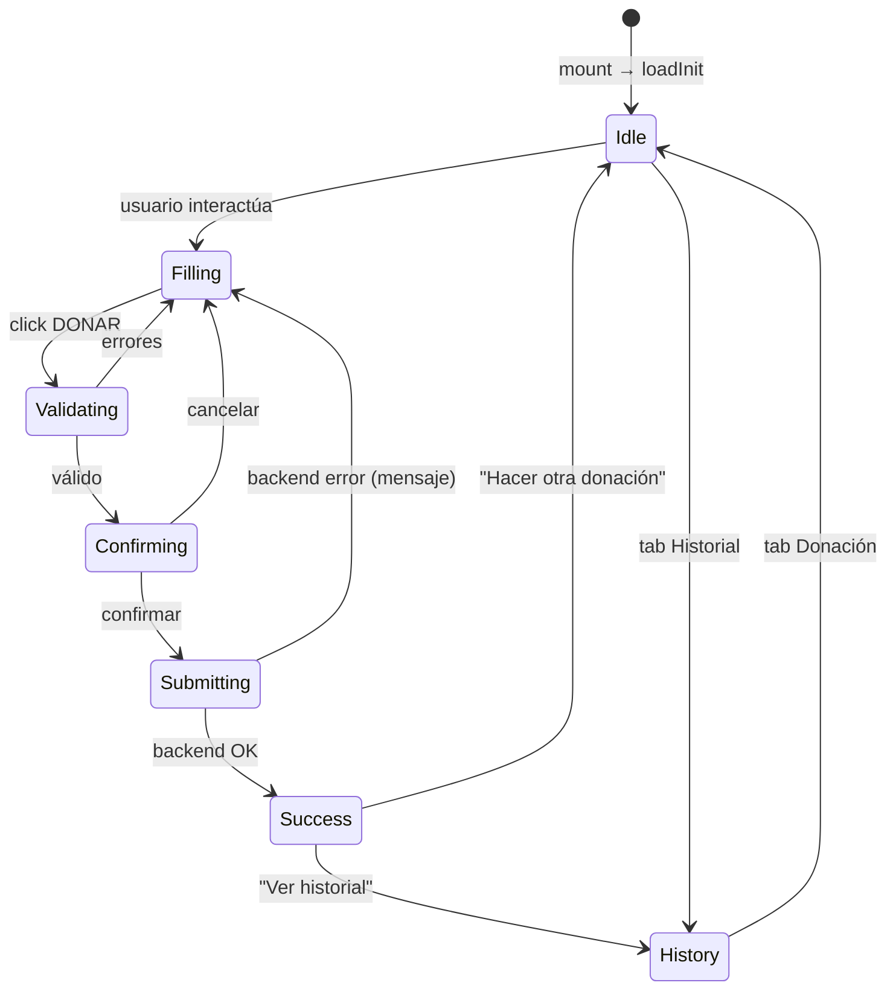
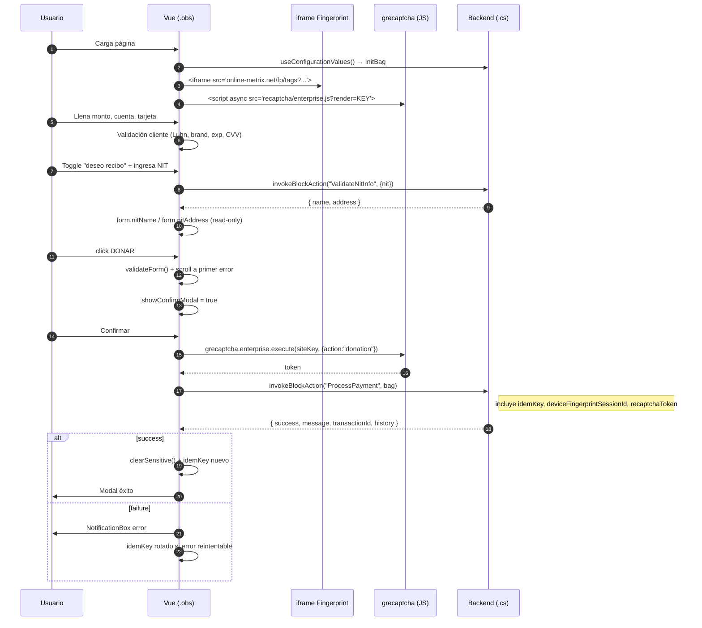
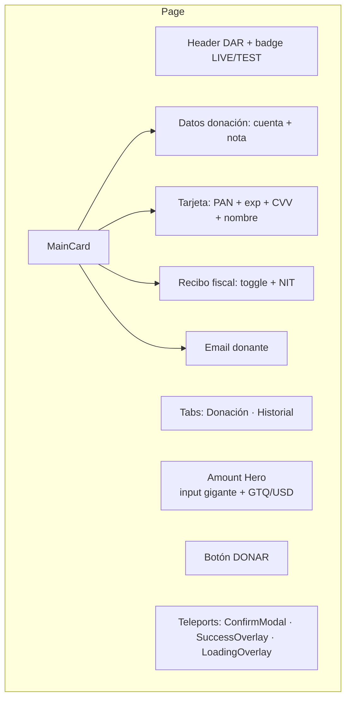
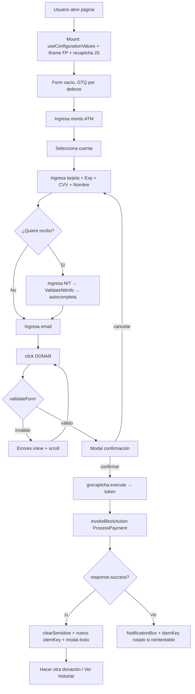

# CybersourceDonationEntry.obs — Documentación Técnica

> **Frontend (Vue 3 / Obsidian SFC)** del flujo de donaciones DAR vía Cybersource.
> **Ruta:** [`Rock.JavaScript.Obsidian.Blocks/src/Dar/CybersourceDonationEntry.obs`](CybersourceDonationEntry.obs)
> **Backend pareado:** [`Rock.Blocks/Dar/CybersourceDonationEntry.cs`](../../../../Rock.Blocks/Dar/CybersourceDonationEntry.cs)
> **Rama actual:** `hotfix-18.1` · **Última actualización:** 2026-04-29
>
> **Marcas soportadas:** Visa y Mastercard. **AmEx no está habilitada** en el merchant (procesa por `vdcguatemala`); el componente bloquea AmEx en tiempo real al teclear y al enviar — ver §8.

---

## Índice

1. [Propósito](#1-propósito)
2. [Estructura del archivo](#2-estructura-del-archivo)
3. [Dependencias e imports](#3-dependencias-e-imports)
4. [Estado reactivo](#4-estado-reactivo)
5. [Diagramas](#5-diagramas)
6. [Anatomía del template](#6-anatomía-del-template)
7. [Flujo end-to-end del usuario](#7-flujo-end-to-end-del-usuario)
8. [Validaciones cliente](#8-validaciones-cliente)
9. [Anti-fraude del cliente](#9-anti-fraude-del-cliente)
10. [Comunicación con backend](#10-comunicación-con-backend)
11. [Funciones helper](#11-funciones-helper)
12. [Estilos](#12-estilos)
13. [Accesibilidad](#13-accesibilidad)
14. [Catálogo rápido de funciones](#14-catálogo-rápido-de-funciones)
15. [Errores comunes y debugging](#15-errores-comunes-y-debugging)

---

## 1. Propósito

Componente Obsidian (Vue 3 SFC con extensión `.obs`) que renderiza el **formulario público de donaciones DAR**:

- Input ATM-style del **monto** con switch GTQ ⇄ USD.
- Selección de **cuenta financiera**.
- Datos de **tarjeta** (con detección de marca, Luhn, máscaras).
- Toggle de **recibo fiscal** con autocompletado por **NIT** (vía API SAT).
- **Modal de confirmación** previo al cobro.
- **Overlay de éxito** y **historial** de pagos para usuarios logueados.
- Integración con **reCAPTCHA Enterprise** y **Device Fingerprint** de Cybersource.

---

## 2. Estructura del archivo

| Sección | Líneas | % | Contenido |
|---|---|---|---|
| `<template>` | 1-415 | ~16% | Panel, hero monto, formulario, modales, historial. |
| `<script setup>` | 417-1273 | ~32% | Lógica TS: state, computed, validaciones, actions. |
| `<style>` | 1275-2649 | ~52% | CSS scoped con prefijo `.cyWrap`, responsive, animaciones. |

Patrones notables:
- **`<Teleport to="body">`** para modal de confirmación y overlay de éxito (escapan del árbol DOM del Panel).
- **Directiva personalizada `v-click-outside`** para cerrar dropdown de cuentas ([líneas 634-646](CybersourceDonationEntry.obs#L634-L646)).
- **iframe oculto** para Device Fingerprinting de Cybersource Decision Manager.
- **Importación de fuentes Google** (Manrope, Plus Jakarta Sans) en CSS.

---

## 3. Dependencias e imports

```ts
// Vue 3 Composition API
import { computed, reactive, ref, type DirectiveBinding } from "vue";

// Componentes Obsidian
import Panel from "@Obsidian/Controls/panel.obs";
import NotificationBox from "@Obsidian/Controls/notificationBox.obs";
import RockButton from "@Obsidian/Controls/rockButton.obs";

// Utilidades de bloque
import { useConfigurationValues, useInvokeBlockAction } from "@Obsidian/Utility/block";
```

### Tipos definidos localmente

```ts
type CardBrand = "visa" | "mastercard" | "amex" | "discover" | "unknown";

type AccountOptionBag = { id: number; publicName: string };

type PaymentHistoryBag = {
  transactionId: number;
  transactionDateTime: string;
  amount: number;
  accountName: string;
  responseCode, status, statusMessage,
  referenceNumber, auditNumber, authorizationNumber,
  currency, mode, accountNumberMasked, summary: string;
};

type InitBag = {
  notLogged: boolean;
  defaultCurrency: "GTQ" | "USD";
  mode: "live" | "test";
  accounts: AccountOptionBag[];
  history: PaymentHistoryBag[];
  currentPersonEmail: string;
  cybersourceOrgId: string;
  cybersourceMerchantId: string;
  recaptchaSiteKey: string;
};
```

> **Sin props ni emits.** El bloque obtiene su configuración de `useConfigurationValues<InitBag>()` y se comunica con el backend solo a través de `invokeBlockAction`.

---

## 4. Estado reactivo

### Refs principales ([líneas 588-631](CybersourceDonationEntry.obs#L588-L631))

| Variable | Tipo | Propósito |
|---|---|---|
| `busy` | `ref(false)` | Procesando cobro (overlay de carga). |
| `busyHistory` | `ref(false)` | Cargando historial. |
| `busyNit` | `ref(false)` | Validando NIT. |
| `errorMessage` | `ref("")` | Mensaje de error global. |
| `successMessage` | `ref("")` | Mensaje de éxito (activa modal). |
| `lastResult` | `ref<ProcessPaymentResult\|null>` | Último resultado del backend. |
| `activeSubmenu` | `ref<"donation"\|"history">` | Tab activa. |
| `showConfirmModal` | `ref(false)` | Modal de confirmación visible. |
| `accountDropdownOpen` | `ref(false)` | Dropdown de cuentas abierto. |
| `centValue` | `ref(0)` | **Fuente de verdad del monto en centavos** (ATM behavior). |
| `idemKey` | `ref("")` | Clave de idempotencia (timestamp36+random). |
| `deviceFingerprintSessionId` | `const` | Hex(32) generado al montar. |

### Formulario reactivo

```ts
const form = reactive({
  accountId: 0,
  amount: 0,                     // derivado de centValue
  note: "",
  currency: "GTQ" as "GTQ"|"USD",
  cardName: "", cardNumber: "",
  expDate: "",                   // "MM/AA"
  cvv: "",
  wantsReceipt: false,
  nit: "", nitName: "", nitAddress: "",
  donorEmail: ""
});

const fieldErrors = reactive({
  accountId: "", amount: "", currency: "", note: "",
  cardName: "", cardNumber: "", expDate: "", cvv: "",
  nit: "", donorEmail: ""
});
```

### Computed clave ([líneas 661-710](CybersourceDonationEntry.obs#L661-L710))

| Computed | Salida | Uso |
|---|---|---|
| `cardNumberDigits` | string | Solo dígitos del PAN. |
| `cardBrand` | `CardBrand` | Detección por IIN. |
| `cardBrandLabel` | string | Texto visible ("Visa"). |
| `expectedCvvLength` | `3\|4` | Amex usa 4. |
| `heroAmountInputDisplay` | `"12.34"` | Display formateado del centValue. |
| `heroAmountInputWidth` | `"8.5ch"` | Ancho dinámico del input hero. |
| `amountPreview` | `"Q1,234.56"` / `"$..."` | Preview con símbolo. |
| `cardPreviewNumber` | `"4111 1111 1111 1111"` | Tarjeta formateada con espacios. |
| `cardPreviewName` / `cardPreviewExp` | string | Para modal de confirmación. |

---

## 5. Diagramas

### 5.1. Diagrama de estados



### 5.2. Secuencia — interacción cliente con backend



### 5.3. Layout visual



---

## 6. Anatomía del template

```html
<Panel type="block">
  <iframe v-if="config.cybersourceOrgId" ... aria-hidden="true" />     <!-- Device Fingerprint -->

  <!-- Overlay carga -->
  <div v-if="busy" class="cyStateOverlay"> <spinner/> </div>

  <!-- Overlay éxito -->
  <Teleport to="body">
    <div v-if="successMessage" class="cyStateOverlay --success">
      <checkmark/> <h2>¡Gracias por su donación!</h2>
      <RockButton @click="resetFormSuccess">Hacer otra donación</RockButton>
      <RockButton v-if="!config.notLogged" @click="goToHistoryFromSuccess">Ver historial</RockButton>
    </div>
  </Teleport>

  <header class="cyTopBar"> ... </header>

  <nav role="tablist"> Donación | Historial </nav>

  <!-- Hero monto -->
  <section class="cyAmountHero">
    <input :value="heroAmountInputDisplay" @input="onHeroAmountInput" />
    <div class="cyCurrencySwitch"> GTQ | USD </div>
  </section>

  <!-- Formulario -->
  <section v-if="activeSubmenu === 'donation'" class="cyMainCard">
    <div class="cySection">  <!-- cuenta + nota --> </div>
    <div class="cySection">  <!-- tarjeta -->        </div>
    <div class="cySection">  <!-- toggle recibo --> </div>
    <div class="cySection">  <!-- email -->          </div>
    <NotificationBox v-if="errorMessage" :alertType="'danger'">{{ errorMessage }}</NotificationBox>
    <RockButton btnType="primary" @click="openConfirmModal">DONAR</RockButton>
  </section>

  <!-- Historial -->
  <section v-else class="cyHistory"> ... tabla ... </section>

  <!-- Modal confirmación -->
  <Teleport to="body">
    <div v-if="showConfirmModal" class="cyConfirmOverlay">
      <div class="cyConfirmModal">
        <!-- preview cuenta, monto, tarjeta, titular -->
        <RockButton @click="showConfirmModal=false">Cancelar</RockButton>
        <RockButton btnType="primary" @click="confirmAndSubmit">Confirmar donación</RockButton>
      </div>
    </div>
  </Teleport>
</Panel>
```

---

## 7. Flujo end-to-end del usuario



### Pasos resumidos

| Paso | Acción | Validación |
|---|---|---|
| 1 | Monto (ATM input) | `amount > 0` |
| 2 | Cuenta + nota | accountId válido, nota ≤ 250 |
| 3 | Tarjeta | Luhn, brand, exp no vencida, CVV 3-4 |
| 4 | Recibo (opcional) | si activo, `nitName` debe estar poblado por NIT API |
| 5 | Email | regex básico |
| 6 | Confirmación | re-ejecuta `validateForm()` |
| 7 | Envío | reCAPTCHA token + idemKey |

---

## 8. Validaciones cliente

### Reglas

| Campo | Regla | Línea aprox |
|---|---|---|
| `accountId` | > 0 | 920 |
| `amount` | > 0 | 925 |
| `cardName` | no vacío | — |
| `cardNumber` | Luhn + 12-19 dígitos | 729 |
| `cardBrand` | **No puede ser `amex`** (procesador no soporta) | 968-971 |
| `expDate` | parse MM/YY válido + no vencida | 770, 789 |
| `cvv` | longitud según brand (3 o 4) | 851 |
| `nit` | si recibo activo, validado por API | 934 |
| `donorEmail` | regex `/^[^\s@]+@[^\s@]+\.[^\s@]+$/` | 944 |
| `note` | ≤ 250 chars | 954 |

### Bloqueo en tiempo real de AmEx

Para evitar que el usuario llene todo el formulario y reciba un rechazo en el cobro, la marca AmEx se detecta y se bloquea desde el primer dígito en `onCardNumberInput`:

```ts
function onCardNumberInput(): void {
  fieldErrors.cardNumber = "";
  const digits = (form.cardNumber || "").replace(/[^\d]/g, "");
  const brand = detectCardBrand(digits);
  form.cardNumber = formatCardNumberDigits(digits, brand);

  if (brand === "amex") {
    fieldErrors.cardNumber = "American Express no está disponible. Usa Visa o Mastercard.";
  }
}
```

`validateForm` repite la verificación al submit como defensa adicional. Cuando se habilite AmEx con el adquiriente, eliminar ambos bloques.

### Algoritmos clave

#### `luhnCheck` — checksum del PAN
```ts
function luhnCheck(pan: string): boolean {
  let sum = 0, alt = false;
  for (let i = pan.length - 1; i >= 0; i--) {
    let d = +pan[i];
    if (alt) { d *= 2; if (d > 9) d -= 9; }
    sum += d;
    alt = !alt;
  }
  return pan.length >= 12 && pan.length <= 19 && sum % 10 === 0;
}
```

#### `detectCardBrand` — detección por IIN
- Visa: `^4`
- Mastercard: `^5[1-5]` o `^2(2[2-9]|[3-6]\d|7[01]|720)`
- Amex: `^3[47]`
- Discover: `^6011|^65|^64[4-9]`

#### `parseExpiry` — `"MM/YY"` → `{month, year, valid}`
Convierte `YY` a `2000+YY` y exige `1 ≤ month ≤ 12`.

#### Máscara de input PAN
- Amex (15 dígitos): `4-6-5`
- Otros (16-19): grupos de 4

---

## 9. Anti-fraude del cliente

### 9.1. Device Fingerprinting (Cybersource Decision Manager)

```html
<iframe
  v-if="config.cybersourceOrgId"
  :src="`https://h.online-metrix.net/fp/tags?org_id=${orgId}&session_id=${merchantId}${sessionId}`"
  width="1" height="1"
  style="opacity:0; position:absolute"
  aria-hidden="true" tabindex="-1"
></iframe>
```

- `sessionId` = 32 hex chars generado en `setup()`.
- Se envía al backend como `deviceFingerprintSessionId` en `ProcessPayment`.
- Cybersource recolecta: IP, User-Agent, plugins, canvas fingerprint, geo, etc.

### 9.2. reCAPTCHA Enterprise

```ts
async function getRecaptchaToken(): Promise<string> {
  if (!config.recaptchaSiteKey) return "";
  await ensureRecaptchaLoaded();
  return await new Promise<string>((resolve) => {
    window.grecaptcha.enterprise.ready(() => {
      window.grecaptcha.enterprise
        .execute(config.recaptchaSiteKey, { action: "donation" })
        .then(resolve);
    });
  });
}
```

- Token solicitado **fresh en cada submit**.
- Acción exacta: `"donation"` (debe coincidir con backend).
- Cargado dinámicamente solo si hay `siteKey`.

### 9.3. Idempotencia

```ts
function generateIdemKey(): string {
  return Date.now().toString(36) + Math.random().toString(36).slice(2, 12);
}
```

- Clave única generada al montar y rotada tras éxito o error reintentable.
- Backend usa esta clave en última hora para detectar duplicados.

### 9.4. Limpieza de datos sensibles

```ts
function clearSensitive() {
  form.cardNumber = "";
  form.expDate = "";
  form.cvv = "";
}
```

Llamado tras éxito y antes de cualquier `console.log` accidental.

---

## 10. Comunicación con backend

### Block actions invocadas

| Action | Cuándo | Payload | Respuesta |
|---|---|---|---|
| `ValidateNitInfo` | Click "Validar NIT" | `{ nit }` | `{ name, address }` |
| `GetPaymentHistory` | Tab Historial / tras éxito | `{}` | `{ history: PaymentHistoryBag[] }` |
| `ProcessPayment` | Confirmación de donación | `{ bag: ProcessPaymentRequestBag }` | `ProcessPaymentResponseBag` |

### Payload de `ProcessPayment`

```ts
{
  bag: {
    accountId: number,
    amount: number,            // GTQ o USD
    note: string,
    currency: "GTQ"|"USD",
    cardName: string,
    cardNumber: string,        // dígitos solamente
    expMonth: 1..12,
    expYear: number,           // 4 dígitos
    cvv: string,
    wantsReceipt: boolean,
    nit: string,
    nitName: string,           // poblado por ValidateNitInfo
    nitAddress: string,
    donorEmail: string,
    auditNumber: string,       // optional reference
    idemKey: string,           // anti-duplicado
    deviceFingerprintSessionId: string,
    recaptchaToken: string
  }
}
```

### Manejo de respuesta

```ts
const response = await invokeBlockAction<any>("ProcessPayment", { bag });

if (!response.isSuccess) {
  errorMessage.value = response.errorMessage ?? "Error desconocido.";
  return;
}

const result: ProcessPaymentResponseBag = response.data;
if (result.success) {
  successMessage.value = result.message;
  history.value = result.history;
  clearSensitive();
  idemKey.value = generateIdemKey();
} else {
  errorMessage.value = result.message;
  if (safeRetry.has(result.responseCode)) {
    idemKey.value = generateIdemKey();   // permite reintento sin colisionar
  }
}
```

---

## 11. Funciones helper

| Función | Línea | Descripción |
|---|---|---|
| `detectCardBrand(pan)` | 717 | Marca por IIN. |
| `luhnCheck(pan)` | 729 | Checksum PAN. |
| `formatCardNumberDigits(digits, brand)` | 755 | Espacios cada 4 (o 4-6-5 Amex). |
| `parseExpiry(value)` | 770 | `"MM/YY"` → `{month, year, valid}`. |
| `isExpired(month, year)` | 789 | Comparación con fecha actual. |
| `clearSensitive()` | 810 | Borra cardNumber/expDate/cvv. |
| `onHeroAmountInput(e)` | ~830 | ATM-style: solo dígitos → centavos. |
| `onCardNumberInput(e)` | ~820 | Aplica máscara, actualiza `cardBrand`, **bloquea AmEx** con mensaje inline. |
| `onExpDateInput(e)` | ~870 | Inserta `/` automático. |
| `onCvvInput(e)` | ~880 | Solo dígitos hasta `expectedCvvLength`. |
| `validateForm()` | 914 | Validación completa, llena `fieldErrors`, scroll. |
| `openConfirmModal()` | ~990 | Valida y abre modal. |
| `confirmAndSubmit()` | ~1005 | Cierra modal y llama `submitPayment`. |
| `submitPayment()` | ~1018 | Pipeline cliente: re-valida + recaptcha + invoke. |
| `loadHistory()` | ~1110 | Llama `GetPaymentHistory`. |
| `validateNit()` | ~1170 | Llama `ValidateNitInfo`. |
| `resetFormSuccess()` | ~1130 | Reset post-éxito. |
| `goToHistoryFromSuccess()` | ~1150 | Cambia a tab historial. |
| `formatMoney(amount, currency)` | ~1230 | `"Q1,234.56"` / `"$1,234.56"`. |
| `formatDate(iso)` | ~1210 | Fecha legible. |
| `statusLabel(status)` | ~1244 | Localiza estados ("APPROVED" → "Aprobada"). |
| `generateIdemKey()` | ~620 | Timestamp36 + random. |

---

## 12. Estilos

### Variables CSS

```css
.cyWrap {
  --cy-black: #090909;
  --cy-gray-100: #f3f3f3;
  --cy-gray-300: #d5d5d5;
  --cy-danger: #c22016;
  --cy-success: #0f8f53;
  --cy-radius-xl: 22px;
  --cy-radius-lg: 14px;
  --cy-radius-pill: 999px;
}
```

### Clases principales

| Clase | Propósito |
|---|---|
| `.cyWrap` | Contenedor raíz (gradiente). |
| `.cyTopBar` | Header con logo. |
| `.cyAmountHero` | Zona del input gigante. |
| `.cyAmountNumberInput` | Input ATM hero (`clamp(38px, 13vw, 120px)`). |
| `.cyCurrencySwitch` | Toggle GTQ/USD. |
| `.cyMainCard` | Card del formulario. |
| `.cySection` | Sección dentro del card. |
| `.cyField` / `.cyCardField` | Wrapper label+input. |
| `.cyInputWrap` | Wrapper con tag de marca. |
| `.cyCardBrandTag` | Badge "Visa"/"Mastercard". |
| `.cyFieldError` | Mensaje rojo bajo input. |
| `.cySwitch` | Toggle CSS puro (recibo). |
| `.cyStateOverlay` | Overlay carga/éxito. |
| `.cyConfirmOverlay` / `.cyConfirmModal` | Modal confirmación. |

### Animaciones (`@keyframes`)

| Nombre | Duración | Uso |
|---|---|---|
| `cyRise` | 0.35s | Mount inicial. |
| `cyFadeIn` | 0.30s | Modales y secciones condicionales. |
| `cyScaleUp` | 0.30s cubic-bezier | Modal confirmación / éxito. |
| `cySpin` | 0.90s linear infinite | Spinner. |
| `cySlideUp` | 0.40s | Modal mobile (sheet). |

### Breakpoints

| Tamaño | Comportamiento |
|---|---|
| `≤460px` | Mobile pequeño (hero más compacto). |
| `≤575px` | Mobile (modal slide-up). |
| `≥680px` | Tablet (grid 2 columnas en algunas secciones). |
| `≥1080px` | Desktop. |

---

## 13. Accesibilidad

- `role="tablist"` en navegación de tabs ([línea 49](CybersourceDonationEntry.obs#L49)).
- `aria-label` en controles interactivos sin texto visible.
- `aria-hidden="true"` y `tabindex="-1"` en iframe de fingerprint.
- Etiquetas `<label>` asociadas a cada `<input>` mediante anidamiento.
- Mensajes de error en `<small class="cyFieldError">` adyacentes al input.
- Estados de error usan **borde + texto** (no solo color) para daltonismo.
- Botón DONAR con texto explícito; nunca solo icono.
- `<Teleport>` mueve modales al `<body>` para evitar problemas de contexto de stacking y lectores de pantalla.

---

## 14. Catálogo rápido de funciones

### Inicialización
- Mount → `useConfigurationValues<InitBag>()`
- Genera `deviceFingerprintSessionId` y `idemKey`
- Carga script `recaptcha/enterprise.js` si hay `siteKey`

### Inputs (handlers)
- `onHeroAmountInput`, `onCardNumberInput`, `onExpDateInput`, `onCvvInput`, `onNitInput`

### Computed
- `cardNumberDigits`, `cardBrand`, `expectedCvvLength`, `heroAmountInputDisplay`, `amountPreview`, `cardPreviewNumber/Name/Exp`

### Validación
- `validateForm`, `parseExpiry`, `isExpired`, `luhnCheck`

### Acciones
- `openConfirmModal`, `confirmAndSubmit`, `submitPayment`, `loadHistory`, `validateNit`, `resetFormSuccess`, `goToHistoryFromSuccess`

### Anti-fraude
- `getRecaptchaToken`, `generateIdemKey`, `clearSensitive`

### Formato
- `formatMoney`, `formatDate`, `statusLabel`

---

## 15. Errores comunes y debugging

| Síntoma | Causa probable | Solución |
|---|---|---|
| **Botón DONAR no responde** | `validateForm` retorna false silenciosamente | Revisar `fieldErrors` en DevTools y `errorMessage` en NotificationBox. |
| **reCAPTCHA token vacío** | `siteKey` no configurado o script bloqueado por extensiones | Inspeccionar Network → `enterprise.js?render=...` y revisar atributo `RecaptchaSiteKey` en backend. |
| **NIT no autocompleta** | `NitApiUrl` o `NitApiBearerToken` vacíos | Verificar atributos del bloque + Network al `ValidateNitInfo`. |
| **Cobro doble** | `idemKey` no se rota tras error reintentable | Verificar set `safeRetry` y que `submitPayment` regenere clave. |
| **Modal éxito no aparece** | `successMessage.value` no se está asignando | `result.success === true` debe asignar `successMessage`. |
| **Tarjeta válida marcada como inválida** | Marca no soportada o Luhn fail por espacios | Inspeccionar `cardBrand` y `cardNumberDigits` computed. |
| **AmEx siempre rechazada** | Comportamiento esperado — Visanet GT no procesa AmEx | Si se habilitó AmEx con el adquiriente, remover el bloque en `onCardNumberInput` y `validateForm` + el bloque defensivo en `ValidatePaymentRequest` del backend. |
| **Estilos rotos** | Carga de fuente Google bloqueada | Las clases caen a fallback (system-ui), revisar CSP. |
| **Historial vacío post-cobro** | Backend no devuelve `history` en response | Confirmar versión del bloque C# (debe tener `BuildResponseHistory`). |
| **Device fingerprint sin org_id** | `cybersourceOrgId` vacío en InitBag | Backend resuelve por modo: `1snn5n9w` (test) / `k8vif92e` (live). |

### Helpers de debug

```ts
// En consola, desde el componente activo:
window.__cyDonationDebug = {
  form, fieldErrors, idemKey, deviceFingerprintSessionId,
  config, history, lastResult
};
```

> Solo habilitar en `mode === "test"`.

---

> **Mantenimiento:** sincronizar este documento cuando cambien:
> - Imports de `@Obsidian/Controls`.
> - Estructura del DTO `ProcessPaymentRequestBag` en el backend ([CybersourceDonationEntry.cs](../../../../Rock.Blocks/Dar/CybersourceDonationEntry.cs)).
> - Selectores CSS críticos (afectan a tests E2E si existen).
> - Reglas de validación cliente.
